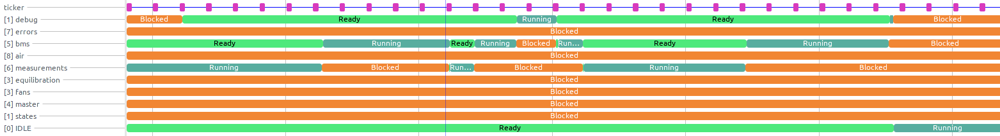

# FreeRTOS Tracing

This repository presents how to easily trace a FreeRTOS system using
[BareCTF](https://barectf.org/) and
[Trace Compass](https://www.eclipse.org/tracecompass/).

## Why?

By reusing existing open source projects, FreeRTOS systems can be
easily traced with low cost. BareCTF is a project that can generates
ANSI C code source for a tracer that produces [CTF](https://diamon.org/ctf/)
data streams. Trace Compass supports both [CTF](https://diamon.org/ctf/)
data streams and user scripted analyses, allowing us to take advantage
of its many views and scalable data structures.

## How?

FreeRTOS already comes with tracepoints inserted in the code source as
C macros. By default, these macros expands to nothing. BareCTF uses YAML
configuration to define the tracer and its events. Once the tracer is
generated, we can provide our own macros that replaces the tracepoints.

To generate the tracer, simply execute `make` at the root of the repository.
In your project, you need to add `include/` to your include directories. You
also need to compile and link the files in `source/` directory.

Finally, you need to include [`freertos-trace.h`](include/freertos-trace.h)
in your `FreeRTOSConfig.h` to replace the placeholder tracepoints.

You might need to adjust [`config.yaml`](config/config.yaml) and
[`freertos-types.yaml`](config/freertos-types.yaml) to fit your system.

## Limitations

BareCTF only generates the CTF tracer. Since there are many kind of embedded
systems (e.g. single core or multiple cores, differents operating systems,
different clock source, etc.), it does not provide any kind of ring buffer
or other optimised data structures.

The platform is **user provided**, its job is to supply the clock source,
store the events in buffers and send (e.g. UART) or save the buffer into
memory (e.g. flash). You can follow the [documentation](https://barectf.org/docs/barectf/3.0/platform/index.html)
to create your own platform.

## Analyses

Trace Compass has many features, supports many trace format and many analyses.
There are many resources on how to get started with it, here's [one](https://github.com/tuxology/tracevizlab).
Javascript analyses are supplied in the `scripts/` directory. To install them
in Trace Compass, you can follow this [guide](https://archive.eclipse.org/tracecompass.incubator/doc/org.eclipse.tracecompass.incubator.scripting.doc.user/User-Guide.html).

### Task States

This analysis uses Trace Compass' state system to generate a control flow view
that shows the state of all task in the system.

### Stack Usage Estimation

Maximum stack usage is likely to be reached at context switch since the task
context is pushed on the stack. This analysis use the stack size after each
task has switched out to **estimate** the stack usage.

## To Do

Many tracepoints are not generated for now since they aren't needed in the
current analyses. That said, they can be easily added.

## Support

Feel free to contact me or open an issue if any help is needed.